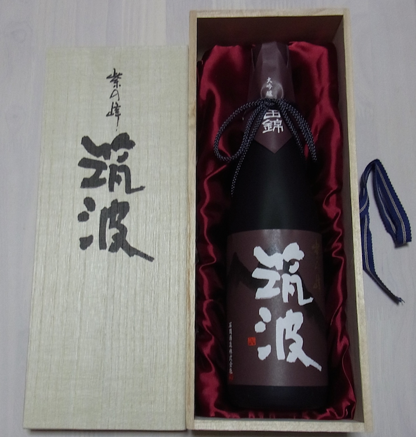
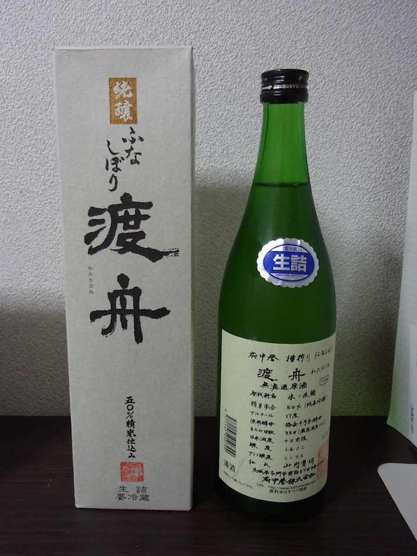
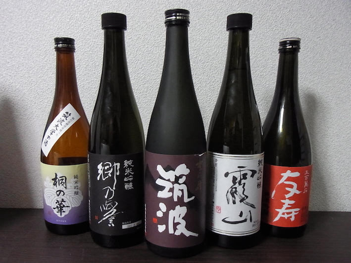

# 茨城県のお酒

---
## 茨城県

+++
TODO 茨城県についてここに書く

---
## 石岡市のお酒

---
### 石岡市

+++

---
### 石岡のお酒 その 1

石岡酒造さん

TODO 筑波などについてここに書く

+++
#### 筑波山

+++
#### 

---
### 石岡のお酒 その 2

府中酒造さん

TODO 渡舟などについてここに書く

---
## 石岡市以外のお酒

TODO 石岡市以外のお酒についてここに書く

---
## おわり

Thank you for listening!
