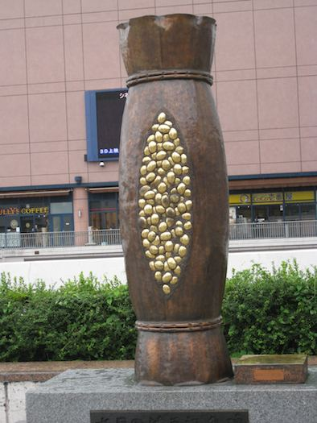

# 茨城県のお酒

---

## 茨城県

+++

---

## 石岡市のお酒

---
### 石岡市

+++

奈良時代には **[常陸国の国府](https://ja.wikipedia.org/wiki/常陸国)** が置かれていました

+++

##### "石岡市は古来より、関東有数の醸造のまちとして知られ、明治時代には茨城県内最大の醸造のまちとして、「関東の灘」と呼ばれていました。"
##### "酒造りに最適なこの水を使い、平安時代には、すでに酒造りが行われていたとも言われています。"
 
... [石岡動画チャンネル vol.8, 石岡の地酒](http://www.city.ishioka.lg.jp/page/page003173.html) より引用

---
### 石岡のお酒 その 1

[石岡酒造](http://www.ishiokashuzo.co.jp)さん

+++
#### [筑波 紫の峰](https://www.amazon.co.jp/dp/B007IFMNXC/ref=cm_sw_r_tw_dp_x_mZdeAbHH5FWGX)

+++

#### 筑波山

---

### 石岡のお酒 その 2

[府中誉](http://www.huchuhomare.com)さん

+++ 

### [渡舟](https://www.amazon.co.jp/dp/B005J1FBAY/ref=cm_sw_r_tw_dp_x_A0deAb74PYNB4)

+++

#### 酒米「渡船 (わたりぶね)」

---

## 石岡市以外のお酒

 

---
## おわり

Thank you for listening!

Enjoy Sake!
